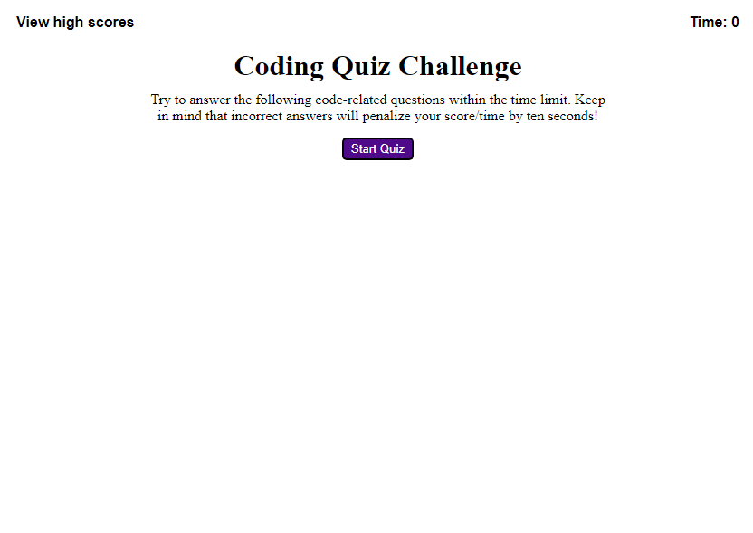

# code-quiz

## Description

The purpose of this project was to put into practice my understanding of Web APIs and create a quiz application using the Document Object Model (DOM). In this project I was able to use the DOM which allowed my JavaScript file to interact with my html file. Using the DOM I was able to create five questions, each with a multiple choice answer, by creating, adding, and deleting elements within the html document. The criteria for this project included common functions found in a number of applications which was part of the motivation for to complete this project. By creating a quiz application with a high scores lists that allows user's to save their scores, I've learned not only how to properly save data to local storage, but I've gained a stronger sense of what JavaScript can achieve through use of the DOM. This application also solves real world problems. Many applications require the use of local storage such as the storage of high scores which is pertinent to me since I have an interest in game development. 

## Installation

No installation is required to view this password generator. Here is a link to the deployed website:
https://seanbl.github.io/code-quiz/

## Usage

The following image shows the web application's appearance and functionality:

This webpage displays the home page of a short quiz that the user can take. The user has the option to start quiz by clicking the "start quiz" button or they can click on the view high scores text to view the list of high scores. Once the quiz begins, the timer in the upper right corner will begin a count down starting at 75 seconds. The user will be given 5 short questions, each with 4 multiple choice answers. At the end of the quiz, the user may add their initials and submit their score to see if their score is entered into the high scores list. 

**Note**: This layout was intended for desktop viewing. The images may not display properly on smartphones or tablets. 

## Credits

N/A

## License

N/A